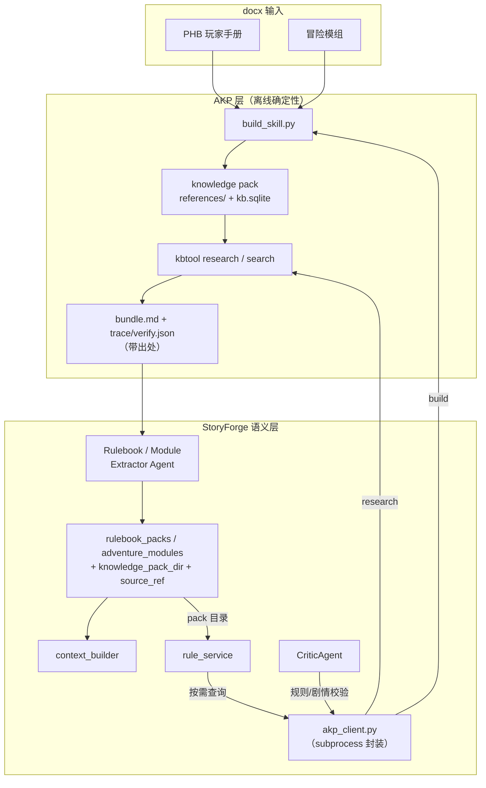

# StoryForge × Auditable Knowledge Packs 集成方案

> **版本**：v1.1 · **创建**：2026-07-08 · **更新**：2026-07-08
> **状态**：✅ P0（模式 A）已实施 · 📋 P1/P2 待实施
> **关联文档**：[ai-module-implementation.md](ai-module-implementation.md) · [ai-module-design.md](ai-module-design.md)
> **外部项目**：Auditable Knowledge Packs（`auditable-knowledge-packs-main.zip`，Apache-2.0），已 vendoring 至 `third_party/akp/`

---

## 0. P0 实施说明（v1.1 落地记录）

模式 A 已按本方案接入，落地时对照真实 AKP 代码做了如下**必要修正**（本文档其余章节保留原始设计，供 P1/P2 参考）：

| 方案原设想 | 真实 AKP 实现 | 落地处理 |
|------------|---------------|----------|
| `kbtool research --run-dir ...` + `verify.json` | kbtool **无 `research` 子命令**；等价能力是 `bundle`（search+bundle 合并一步），产出 `runs/<id>.md`（含 `## References`）+ stdout JSON | `akp_client.research()` 内部调用 `kbtool.py bundle`；`verify_ok` 由「命中数>0 且 bundle 非空」推断 |
| `--focus-doc` | `bundle` 无此参数（有 `--require-term` / `--exclude-term`） | 移除 `focus_doc`，保留 `require_terms` |
| 数据模型改 `models/game.py` | 仓库已统一到 `models/models.py` | `knowledge_pack_dir` 加在 `models.py` 的 `RulebookPack` / `AdventureModule` |
| 依赖 `pdftotext` 处理 docx | AKP docx 提取仅用标准库（zipfile+ElementTree） | 无新增依赖 |

Windows 注意：子进程强制 `PYTHONUTF8=1` / `PYTHONIOENCODING=utf-8` 并以 UTF-8 解码，避免 GBK code page 破坏中文 JSON。

已落地文件：`backend/app/ai/services/akp_client.py`、`backend/app/services/content_ingestion_service.py`（build→bundle→提炼 + 失败回退）、`backend/app/ai/prompts/{rulebook,module}_extractor_bundle.txt`、schema 增 `evidence_bundles` / `source_ref`、模型增 `knowledge_pack_dir`、冒烟测试 `backend/scripts/test_akp_integration.py`（M1 通过）。

---

## 目录

1. [背景与目标](#1-背景与目标)
2. [两个系统的定位](#2-两个系统的定位)
3. [集成总体架构](#3-集成总体架构)
4. [三种集成模式](#4-三种集成模式)
5. [目录、依赖与 Vendoring](#5-目录依赖与-vendoring)
6. [代码接口设计](#6-代码接口设计)
7. [数据模型变更](#7-数据模型变更)
8. [与现有 Agent / Fact 的对接点](#8-与现有-agent--fact-的对接点)
9. [分阶段实施路线图](#9-分阶段实施路线图)
10. [风险、回退与非目标](#10-风险回退与非目标)

---

## 1. 背景与目标

StoryForge 已实现两个内容提取 Agent（见 `ai-module-implementation.md` §3.6/§3.7）：

- **RulebookExtractorAgent**：PHB docx → `world_setting` / `world_style` / `public_world_facts`
- **ModuleExtractorAgent**：模组 docx → `scenes` / `hidden_truths` / `npc_private_facts` 等

当前实现路径为 **docx → 关键词筛选 / 截断 → LLM 一次性提取 → DB**。它在跑团语义上很强，但存在三个结构性弱点：

| 痛点 | 现状 | 后果 |
|------|------|------|
| **超长文档** | PHB ~47 万字符，靠 `select_rulebook_sections()` 关键词筛选 + 截断 | 可能漏掉未命中关键词的规则；token 成本高 |
| **无原文出处** | 仅 `extraction_notes` 备注，无法回跳原文 | 规则/剧情争议时无法举证；Critic 无据可依 |
| **不可复现** | LLM 提取结果随模型 / 温度漂移 | 同一 docx 两次导入结果可能不同 |

**Auditable Knowledge Packs（下称 AKP）** 恰好补齐这三点：确定性、强出处、可复现的**非向量**检索引擎。

### 集成目标

1. 用 AKP 作为规则书 / 模组 docx 的**底层知识引擎**（结构化 + 可检索 + 可回源）。
2. 保留 StoryForge 现有 Extractor Agent 作为**游戏语义层**，在 AKP 证据包之上做提炼。
3. 为落库的 Fact / 规则引用附加 **provenance（出处）**，让 Critic 能校验"这条叙事 / 规则是否有原文依据"。
4. 全程**渐进式**：AKP 不可用时自动回退到现有纯 LLM 路径，不破坏已上线功能。

---

## 2. 两个系统的定位

| 维度 | Auditable Knowledge Packs | StoryForge 内容提取 |
|------|---------------------------|---------------------|
| 核心问题 | 从长文档**可靠找证据** | 从长文档**提炼可玩状态** |
| 离线阶段 | 确定性解析 + FTS5 索引 | LLM 语义压缩 |
| 在线阶段 | 确定性 `research` 检索（不调 LLM） | `context_builder` 读 DB 字段 |
| 输出 | `bundle.md`（带引用）+ `trace/verify.json` | 游戏字段 JSON + Fact 表 |
| 可追溯性 | 强（references + trace + verify） | 弱（仅 extraction_notes） |
| 复现性 | 高（无 LLM 参与检索） | 依赖 LLM |
| 跑团语义 | 无 | 强（Fact 分层、防剧透、clue_pressure） |

**一句话**：AKP 负责"可靠找原文"，StoryForge 负责"可靠玩游戏"。二者是**上下游**，不是二选一。

---

## 3. 集成总体架构



### 数据流（规则书为例）

```text
POST /content/rulebook/extract
  → content_ingestion_service.ingest_rulebook_from_docx()
    ① akp_client.build_pack(docx, skill_name)        # 离线建包（确定性）
    ② akp_client.research(pack, PHB 提问清单)         # 逐题拿 bundle（确定性）
    ③ RulebookExtractorAgent（吃 bundle 而非裸文本）  # LLM 精炼 + 带 source_ref
    ④ save_rulebook_pack(knowledge_pack_dir=...)     # 落库 + 记录包目录
```

---

## 4. 三种集成模式

三种模式**可独立启用、可叠加**，对应实施路线的 P0 / P1 / P2。

### 模式 A — 离线增强提取（替换裸文本输入）

把 Extractor Agent 的输入从"关键词筛选后的裸文本"换成"AKP 针对固定问题清单产出的 bundle"。

- **规则书提问清单**（示例）：`属性检定如何计算？`、`优势与劣势规则？`、`短休与长休恢复？`、`死亡豁免规则？`、`先攻与战斗轮？`
- **模组提问清单**：`故事主线是什么？`、`有哪些关键场景与出口？`、`起始场景在哪？`、`关键隐藏真相？`、`主要 NPC 及其秘密？`
- **收益**：LLM 只读结构化、带引用的证据，漏检率下降、token 下降、每条提炼可挂 `source_ref`。

### 模式 B — 运行时规则查询（rule_service / Narrative）

游戏进行中遇到规则争议时，按需调用 `kbtool research`，而非依赖 LLM 记忆。

- 触发点：`rule_service` 判定某检定 DC / 规则细节时；或 Narrative 需要引用具体规则时。
- 产物：`bundle.md` 直接作为 prompt 片段注入，附 `## References`。
- **收益**：规则表述稳定、可回源；跨模型一致。

### 模式 C — IR 桥接（模组知识库反向导出）

把 `ModuleExtractionOutput` 导出成 AKP 的 **IR JSONL**（`type=doc` + `type=node`），用 `build_skill.py --ir-jsonl` 建成可检索、可审计的模组知识库。

- `scenes[]` → `type=node`（`kind=article`，`title`=场景名，`body_md`=描述+出口+POI）
- `hidden_truths[]` / `npc_private_facts[]` → 独立 node，`aliases` 挂 NPC 名
- **收益**：模组内容变成可审计知识库，供 DM 后台抽查、支持"按线索检索场景"。

---

## 5. 目录、依赖与 Vendoring

### 5.1 AKP 代码放置

AKP 是纯 Python（3.10+）+ SQLite，无重依赖。推荐 **vendoring 到仓库内**，避免运行期外部拉取：

```text
StoryForge/
├── third_party/
│   └── akp/                      # 来自 auditable-knowledge-packs-main/pack-builder
│       ├── scripts/build_skill.py
│       ├── scripts/build_skill_lib/
│       └── templates/            # kbtool.py + kbtool_lib/
├── data/
│   └── knowledge_packs/          # 运行期生成的 skill 包（.gitignore）
│       ├── phb-5e/
│       │   ├── references/
│       │   ├── kb.sqlite
│       │   └── scripts/kbtool.py
│       └── krenko-module/
```

- `third_party/akp/` 纳入版本控制（保留 `LICENSE`、Apache-2.0 归属）。
- `data/knowledge_packs/` **加入 `.gitignore**（生成物，可由 docx 重建）。
- 备选：以 git submodule 引入原仓库；MVP 阶段建议直接 vendoring，简化 CI。

### 5.2 依赖

AKP 本身零第三方依赖（标准库 + sqlite3）。可选：

- `pdftotext`（Poppler）——仅当需要处理可读 PDF；docx 路径不需要。
- 现有 `backend/requirements.txt` 无需新增强制依赖。

### 5.3 配置项（`backend/app/core/config.py` → `Settings`）

```env
# AKP 集成
AKP_ENABLED=false                       # 总开关，默认关闭 → 走现有纯 LLM 路径
AKP_ROOT=third_party/akp                # build_skill.py / templates 所在目录
AKP_PACKS_DIR=data/knowledge_packs      # 生成的 skill 包根目录
AKP_PYTHON=python                       # 运行 AKP 的解释器
AKP_RESEARCH_TIMEOUT_MS=8000            # 单次 research 超时保护
AKP_BUILD_TIMEOUT_S=600                 # 建包超时
```

---

## 6. 代码接口设计

### 6.1 `backend/app/ai/services/akp_client.py`（新增）

封装对 AKP 的 subprocess 调用，**不引入进程内耦合**，便于替换 / 回退。

```python
"""AKP 客户端 — 封装 build_skill.py 与 kbtool 的确定性调用。"""

from __future__ import annotations

import json
import subprocess
from dataclasses import dataclass
from pathlib import Path

from app.core.config import settings


@dataclass
class EvidenceItem:
    node_id: str
    title: str
    text: str
    reference_path: str          # 指向 references/ 的可回跳路径


@dataclass
class ResearchBundle:
    query: str
    bundle_md: str               # 直接可注入 prompt 的证据包
    evidence: list[EvidenceItem]
    run_dir: str
    verify_ok: bool              # verify.roundNN.json 的 ok 字段


def is_enabled() -> bool:
    return bool(settings.akp_enabled)


def build_pack(inputs: list[Path], skill_name: str, *, title: str = "") -> Path:
    """docx/pdf/md → knowledge pack 目录（幂等，--force 重建）。"""
    out_dir = Path(settings.akp_packs_dir)
    cmd = [
        settings.akp_python,
        str(Path(settings.akp_root) / "scripts" / "build_skill.py"),
        "--skill-name", skill_name,
        "--out-dir", str(out_dir),
        "--title", title or skill_name,
        "--force",
        "--inputs", *[str(p) for p in inputs],
    ]
    subprocess.run(cmd, check=True, timeout=settings.akp_build_timeout_s)
    return out_dir / skill_name


def research(
    pack_dir: Path,
    query: str,
    *,
    run_id: str,
    require_terms: list[str] | None = None,
    focus_doc: str | None = None,
) -> ResearchBundle:
    """对已建包执行确定性检索，返回带出处的证据包。"""
    # run_dir 必须位于 skill 根目录内（AKP 安全约束）
    run_dir = f"research_runs/{run_id}"
    cmd = [
        settings.akp_python,
        str(pack_dir / "scripts" / "kbtool.py"),
        "research",
        "--query", query,
        "--run-dir", run_dir,
    ]
    for t in require_terms or []:
        cmd += ["--require-term", t]
    if focus_doc:
        cmd += ["--focus-doc", focus_doc]

    proc = subprocess.run(
        cmd, cwd=str(pack_dir), check=True, capture_output=True, text=True,
        timeout=settings.akp_research_timeout_ms / 1000,
    )
    stdout = json.loads(proc.stdout)
    abs_run_dir = pack_dir / run_dir
    return _parse_bundle(query, abs_run_dir, stdout)
```

关键约束（来自 AKP 文档）：

- `--run-dir` **必须**位于 skill 根目录内 → 用 `research_runs/<run_id>`，`cwd=pack_dir`。
- research 阶段**不调用任何 LLM**；产物为 `bundle.json` / `bundle.md` / `trace.roundNN.json` / `verify.roundNN.json`。
- 建包用 `--force` 保证幂等；大文档可加 `--incremental`。

### 6.2 `content_ingestion_service.py`（改造）

```python
async def ingest_rulebook_from_docx(db, file_path, *, world_id=None, focus="lite_dnd"):
    path = Path(file_path)

    bundles: list[ResearchBundle] = []
    pack_dir = None
    if akp_client.is_enabled():
        pack_dir = akp_client.build_pack([path], skill_name=_slug(path.stem))
        for q in RULEBOOK_QUESTION_SET:            # 模式 A 提问清单
            bundles.append(akp_client.research(pack_dir, q, run_id=_slug(q)))

    raw_text = extract_text_from_docx(path)        # 回退 / 补充用
    result = await ai.extract_rulebook(
        RulebookExtractionInput(
            source_name=path.name,
            raw_text=raw_text,
            focus=focus,
            evidence_bundles=[b.bundle_md for b in bundles],   # 新增字段
        )
    )
    pack = save_rulebook_pack(
        db, result.output,
        source_filename=path.name,
        knowledge_pack_dir=str(pack_dir) if pack_dir else None,   # 新增
    )
    ...
```

- `RulebookExtractionInput` / `ModuleExtractionInput` 增加可选字段 `evidence_bundles: list[str]`。
- Extractor Agent 的 prompt 增加分支：**若有 bundle 则优先基于 bundle 提炼，并要求为每条输出标注 `source_ref`**；无 bundle 时走原逻辑（完全向后兼容）。

### 6.3 运行时规则查询（模式 B）

在 `rule_service` 增加可选查询钩子：

```python
def lookup_rule(world, query: str) -> ResearchBundle | None:
    if not akp_client.is_enabled() or not world.rulebook_pack_id:
        return None
    pack = db.get(RulebookPack, world.rulebook_pack_id)
    if not pack or not pack.knowledge_pack_dir:
        return None
    return akp_client.research(Path(pack.knowledge_pack_dir), query, run_id="runtime")
```

---

## 7. 数据模型变更

`backend/app/models/game.py`：

```python
class RulebookPack(Base):
    ...
    knowledge_pack_dir: Mapped[str | None] = mapped_column(String)   # 新增：AKP skill 目录

class AdventureModule(Base):
    ...
    knowledge_pack_dir: Mapped[str | None] = mapped_column(String)   # 新增
```

Fact 出处（provenance），`Fact` 增加可选列：

```python
class Fact(Base):
    ...
    source_ref: Mapped[str | None] = mapped_column(String)   # 新增：references/ 路径 或 node_id
```

- `content_pack_repository` 落库时把 bundle 的 `reference_path` 写入对应 Fact 的 `source_ref`。
- `GET /content/rulebook/{id}` / `GET /sessions/{id}/facts` 可回带 `source_ref`，供前端 / DM 抽查。

---

## 8. 与现有 Agent / Fact 的对接点

| StoryForge 现有模块 | 对接方式 | 所属模式 |
|---------------------|----------|----------|
| `RulebookExtractorAgent` | 输入增加 `evidence_bundles`，输出带 `source_ref` | A |
| `ModuleExtractorAgent` | 同上；可反向导出 IR 建模组知识库 | A / C |
| `content_ingestion_service` | 先 `build_pack` 再 `research`，最后喂 Agent | A |
| `rule_service` | 争议规则按需 `research`，注入判定说明 | B |
| `NarrativeAgent` | 需要引用规则时，prompt 附 bundle 片段 | B |
| `CriticAgent` | 用 bundle 校验叙事的**规则一致性**是否有原文依据 | B |
| `Fact` / `memory_retriever` | Fact 携带 `source_ref`，检索时回带出处 | A |
| `context_builder` | 无需改动（继续读 DB 字段），provenance 透传 | — |

**Critic 增强（关键价值点）**：现有 `rule_consistency` 维度只能靠 LLM 主观判断；接入 AKP 后，可对 Narrative 中引用的规则调 `research`，若 `verify_ok=false` 或证据不支持，则判定规则引用无据 → 触发修正。

---

## 9. 分阶段实施路线图

### P0 — 基础打通（模式 A，1–2 天）✅ 已完成

- [x] Vendoring：`pack-builder/` → `third_party/akp/`，保留 LICENSE
- [x] `data/knowledge_packs/` 加入 `.gitignore`
- [x] `Settings` 增加 `AKP_*` 配置项（默认 `AKP_ENABLED=false`）
- [x] 新增 `akp_client.py`（`is_enabled` / `build_pack` / `research`(=bundle) / `_parse_bundle`）
- [x] `RulebookExtractionInput` / `ModuleExtractionInput` 增加 `evidence_bundles`
- [x] `content_ingestion_service` 接入"build → bundle → 提炼"（含失败自动回退）
- [x] `RulebookPack` / `AdventureModule` 增加 `knowledge_pack_dir`
- [x] 冒烟测试：`backend/scripts/test_akp_integration.py`（开关开/关行为一致，M1 通过）

### P1 — 出处与运行时查询（模式 B，2–3 天）

- [ ] `Fact` 增加 `source_ref`，落库时写入
- [ ] `rule_service.lookup_rule()` 运行时按需 research
- [ ] `NarrativeAgent` / prompt 支持注入 bundle 片段
- [ ] API 回带 `source_ref`（`/content/*`、`/sessions/{id}/facts`）
- [ ] 测试脚本：`scripts/test_akp_integration.py`

### P2 — 审核闭环与 IR 桥接（模式 C，3–5 天）

- [ ] Critic `rule_consistency` 接 AKP 证据校验，`verify_ok` 纳入评分
- [ ] `ModuleExtractionOutput → IR JSONL` 导出器
- [ ] `build_skill.py --ir-jsonl` 建模组知识库
- [ ] DM 后台"按线索 / 场景检索"（可选前端）

### 里程碑验收

| 里程碑 | 验收标准 |
|--------|----------|
| M1（P0） | `AKP_ENABLED=true/false` 均能成功提取；关闭时行为与现状完全一致 |
| M2（P1） | 落库 Fact 带可回跳 `source_ref`；规则查询返回带引用 bundle |
| M3（P2） | Critic 能因"规则引用无原文依据"驳回；模组可导出为知识库并检索 |

---

## 10. 风险、回退与非目标

### 风险与缓解

| 风险 | 缓解 |
|------|------|
| subprocess 调用增加延迟 | 建包为**离线一次性**；运行时 research 有 `AKP_RESEARCH_TIMEOUT_MS` 保护，失败即回退 |
| AKP 检索为关键词/结构，语义弱 | 由 LLM Extractor 承担语义；AKP 只保证"找到候选原文" |
| Windows / Linux 路径与二进制差异 | MVP 只用 Python 入口（`kbtool.py`），不依赖 PyInstaller 二进制 |
| hooks 执行本地代码的安全性 | 默认**不启用** `--enable-hooks` |
| 生成物体积（kb.sqlite / references） | 不入库，`.gitignore`；可由 docx 幂等重建 |

### 回退策略

`AKP_ENABLED=false`（默认）时，所有新增分支短路，系统行为与当前 `e74a7e2` / 最新提交完全一致。集成为**纯增量、可开关**，不改变既有 API 契约。

### 非目标

- 不用 AKP 替代跑团语义层（Fact 分层、Critic、clue_pressure 仍由 StoryForge 负责）。
- 不引入向量 / embedding（AKP 与本项目均坚持非向量路线）。
- 不在本方案内做前端改造（P2 的 DM 检索为可选项）。

---

## 附录：AKP 关键接口速查

| 用途 | 命令 |
|------|------|
| 建包（docx） | `python third_party/akp/scripts/build_skill.py --skill-name phb-5e --out-dir data/knowledge_packs --inputs PHB.docx --force` |
| 建包（IR） | `... --ir-jsonl module.jsonl --title "追捕克仑可"` |
| 确定性检索 | `cd data/knowledge_packs/phb-5e && python scripts/kbtool.py research --query "属性检定如何计算？" --run-dir research_runs/case-001` |
| 调试召回 | `python scripts/kbtool.py search --pattern "死亡豁免" --out search.md` |
| 重建索引 | `python scripts/kbtool.py reindex` |
| 原子命令 | `kbtool get-node <id>` / `follow-references <id>` |

research 产物：`bundle.json`（LLM 契约）、`bundle.md`（人读证据 + References）、`trace.roundNN.json` / `verify.roundNN.json`（审计 + 机器校验）。

---

## 修订记录

| 版本 | 日期 | 说明 |
|------|------|------|
| v1.0 | 2026-07-08 | 初版：三种集成模式、接口设计、P0–P2 路线图 |
