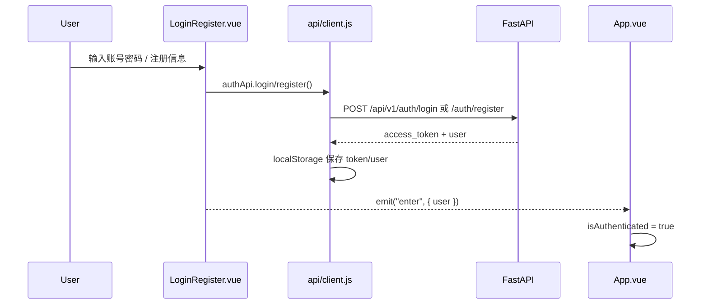
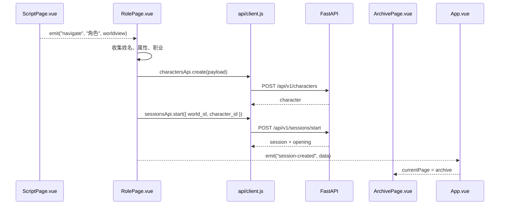

# 前端结构与交互逻辑

> 本文记录当前 `frontend/` 的真实结构、页面职责、状态流转和后端 API 对接方式。后端接口统一挂载在 `/api/v1`，前端开发环境通过 Vite proxy 转发到 `http://localhost:8000`。

## 技术栈

- Vue 3 + `<script setup>`
- Vite
- 原生 `fetch`
- 暂未引入 Vue Router / Pinia；页面切换由 `App.vue` 内部状态驱动。

## 目录结构

```text
frontend/
├─ index.html
├─ package.json
├─ vite.config.js
├─ 背景/
├─ 图标/
├─ 游戏种类/
└─ src/
   ├─ api/
   │  └─ client.js
   ├─ App.vue
   ├─ LoginRegister.vue
   ├─ HomePage.vue
   ├─ JoinRoomModal.vue
   ├─ ScriptPage.vue
   ├─ RolePage.vue
   ├─ ArchivePage.vue
   ├─ main.js
   └─ style.css
```

## 核心文件职责

| 文件 | 职责 |
|---|---|
| `src/main.js` | 创建 Vue 应用并挂载到 `#app`。 |
| `src/App.vue` | 应用壳层；维护登录态、当前页面、选中的世界观、最近创建的会话。 |
| `src/api/client.js` | 统一 API client；负责 base URL、token 存取、请求封装、响应解包、错误处理。 |
| `src/LoginRegister.vue` | 登录、注册、游客进入；对接 `/auth/login`、`/auth/register`。 |
| `src/HomePage.vue` | 大厅；读取世界观、角色、会话；可创建/继续会话。 |
| `src/JoinRoomModal.vue` | 加入房间弹窗；支持输入房间号或选择公开房间。 |
| `src/ScriptPage.vue` | 世界观馆；固定展示 DND / COC / 自定义三张设计卡，并将后端 `world_id` 注入对应卡片。 |
| `src/RolePage.vue` | 角色创建；创建角色后自动开启会话。 |
| `src/ArchivePage.vue` | 档案馆；读取 `/sessions` 展示历史会话。 |

## 页面切换

当前没有使用 Vue Router，页面切换集中在 `App.vue`：

```text
LoginRegister
  -> enter
App.vue
  -> currentPage = home | script | role | archive
  -> dynamic component
```

页面别名映射：

```text
大厅   -> HomePage
世界观 -> ScriptPage
角色   -> RolePage
档案   -> ArchivePage
```

## 认证流程



本地存储键：

| Key | 内容 |
|---|---|
| `storyforge_access_token` | bearer token |
| `storyforge_user` | 当前用户信息 |
| `storyforge_auth_session` | 记住的用户名 |

游客进入会清除 token，并依赖后端无 token 时回落到 demo user 的兼容逻辑。

## 世界观页逻辑

`ScriptPage.vue` 的展示数据以设计稿为主，后端数据只做 ID 注入：

```text
fallbackWorldviews: DND / COC / 自定义世界观
       +
GET /api/v1/worlds
       |
classifyBackendWorld()
       |
backendWorldIdByKind = { dnd, coc, custom }
       |
worldviews = fallbackWorldviews + backendId/worldId
```

这样可以保证：

- 页面始终显示设计稿中的三张世界观卡。
- 即使后端种子数据变化，也不会覆盖前端视觉结构。
- 进入世界观或模组时仍然能带上对应 `world_id`。

## 角色创建与开局



DND 创建使用后端要求的标准数组：

```text
8, 10, 12, 13, 14, 15
```

COC 暂时走兼容模式：将百分制属性按 `/5` 映射到后端通用角色属性，后续可单独扩展 COC 规则模型。

## 大厅交互

`HomePage.vue` 进入后会并行读取：

- `GET /worlds`
- `GET /characters`
- `GET /sessions`

主要行为：

| 行为 | 逻辑 |
|---|---|
| 创建房间 | 如果没有角色，跳转角色创建；如果已有角色，调用 `/sessions/start`。 |
| 加入房间 | 打开 `JoinRoomModal.vue`；输入会话 ID 后调用 `/sessions/{id}`，选择已有会话则进入档案上下文。 |
| 继续冒险 | 如果有最近会话，进入档案页并选中会话上下文。 |
| 历史档案 | 跳转 `ArchivePage.vue`。 |

## 档案页交互

`ArchivePage.vue` 通过 `GET /sessions` 读取真实会话。

如果接口失败或没有会话，会保留本地示例档案作为兜底展示，避免页面空白。

## API 对照

| 前端方法 | 后端接口 |
|---|---|
| `authApi.register` | `POST /api/v1/auth/register` |
| `authApi.login` | `POST /api/v1/auth/login` |
| `authApi.me` | `GET /api/v1/auth/me` |
| `worldsApi.list` | `GET /api/v1/worlds` |
| `charactersApi.create` | `POST /api/v1/characters` |
| `charactersApi.list` | `GET /api/v1/characters` |
| `sessionsApi.start` | `POST /api/v1/sessions/start` |
| `sessionsApi.list` | `GET /api/v1/sessions` |
| `sessionsApi.get` | `GET /api/v1/sessions/{id}` |
| `sessionsApi.action` | `POST /api/v1/sessions/{id}/action` |

## 当前注意事项

- 世界观页不要直接用后端世界列表替换设计卡片；只注入 `world_id`。
- 当前没有真实游戏行动页，角色创建后的会话会先进入档案页。
- PDF 导出、完整 COC 角色规则、DND 复杂种族/技能选择仍属于后续增强。
- 生产环境需要替换演示 token 方案为标准 JWT/RBAC。
