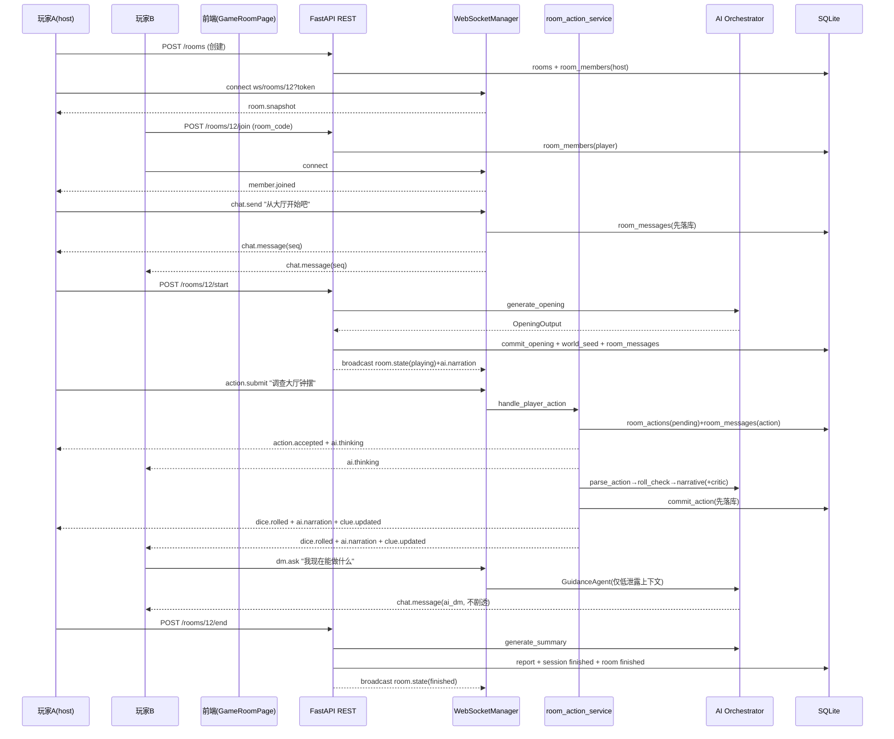

# 多人房间与 AI DM 实时跑团 · 技术设计

> 本文在 [StoryForge_多人房间与 AI DM 扩展技术指导] 的方向指引基础上，结合仓库**真实的前后端实现**做逐层细化，给出可直接落地的工作流、数据模型、REST/WebSocket 协议、AI DM 多人编排、前后端目录结构与实施优先级。
>
> 关联文档：[implementation-spec.md](implementation-spec.md)（单人 MVP 规格）、[architecture.md](architecture.md)（当前架构）、[frontend-structure.md](frontend-structure.md)（前端现状）、[ai-module-design.md](ai-module-design.md)（AI 模块）。
>
> 设计原则：**不破坏现有单人 REST 闭环**，以 `GameSession + Message + action_service.handle_action + state_committer.commit_action` 为扩展锚点，新增 room / membership / realtime 层。

---

## 0. 现状基线（扩展前必须对齐的事实）

以下为仓库**当前真实实现**，本设计的所有改动都以此为准，而非凭空假设。

### 0.1 后端

| 维度 | 现状 |
|------|------|
| 框架 | FastAPI，路由统一挂载 `/api/v1`，响应包装 `{code, message, data}`（`code==0` 成功） |
| 会话模型 | `GameSession`（表 `game_sessions`）为 **1 用户 + 1 角色 + 1 世界 = 1 局**；**无** `room_id` / `mode` / `host_user_id` |
| 行动闭环 | `POST /sessions/{id}/action` → `action_service.handle_action(db, session_id, user_id, action_text)` |
| 落库通道 | `state_committer.commit_opening / commit_action`；`commit_action` 中玩家消息 `sender_name` **硬编码为 `"Player"`** |
| 会话约束 | `session_service.start_session`：**每用户仅允许 1 个 `status=playing` 会话**；`get_playing_session` 仅校验 `session.user_id == user_id` |
| 鉴权 | `deps.get_current_user_id`：无 `Authorization` 头回退 `DEMO_USER_ID=1`；Token 为**自定义格式**（`base64url(payload).hmac_sha256`，非标准 JWT 库），由 `auth_service` 签发/校验，payload 含 `sub`(user_id)/`username`/`exp` |
| AI 编排 | `ai_service.get_ai_service()` 暴露 `generate_opening / parse_action / generate_narrative / generate_summary`；Critic↔Narrative 修订循环在 `ai/services/revision_loop.py` |
| 上下文 | `context_builder.build_for_opening / build_for_action / build_for_summary`（只读 DB 组装，不调 LLM） |
| 建表 | `db/init_db.py` 用 **ORM `Base.metadata.create_all`**（`schema.sql` 仅参考）；启动时 `init_db()` + `seed_demo_data()` |
| 实时能力 | **无** WebSocket / SSE / socket.io；消息靠 `GET /sessions/{id}/messages` 轮询拉取 |

### 0.2 前端

| 维度 | 现状 |
|------|------|
| 技术栈 | Vue 3 `<script setup>` + Vite；**原生 fetch**；**无** Vue Router / Pinia / axios |
| 路由 | `App.vue` 状态驱动：`currentPage ∈ {home, script, role, archive}`，动态 `<component>` |
| API 层 | `src/api/client.js`：`apiRequest()` 封装，token 存 `localStorage.storyforge_access_token`，暴露 `authApi / worldsApi / charactersApi / sessionsApi` |
| 加入房间 | `JoinRoomModal.vue` 为**纯 UI 弹窗**，加入逻辑在 `HomePage.handleJoinRoom`，真实路径依赖数字会话 ID 走 `sessionsApi.get` |
| 跑团页 | **无真实游戏行动页**；`sessionsApi.action / messages` 已封装但**无页面调用**；`src/房间主页面.html` 是**静态四栏原型**（左角色 / 中聊天 / 右状态），可作为 `GameRoomPage.vue` 的 UI 蓝本 |
| 实时能力 | **无** WebSocket 代码 |

> 结论：多人实时是**纯增量扩展**。单人模式（`mode='single'`）沿用现有全部逻辑；多人模式（`mode='multiplayer'`）通过 room 层复用同一套 AI 编排与落库通道。

---

## 1. 目标与新增闭环

**目标定义**

```text
StoryForge 是一个支持多人房间实时交流、角色协作行动、AI DM 叙事推进、
后端规则判定与跑团日志持久化的 Web 跑团平台。
```

**新增核心闭环**

```text
创建房间 / 加入房间（REST）
  → 房间内实时聊天（WebSocket）
  → 玩家选择角色并准备（REST + WS 广播）
  → 房主开始跑团（REST → 复用 OpeningAgent）
  → AI DM 生成开局并广播（WS: ai.narration）
  → 玩家聊天讨论 / 提交行动（WS: chat.send / action.submit）
  → 后端掷骰判定（复用 rule_service.roll_check）
  → AI DM 推进剧情并广播（复用 handle_action → WS 广播）
  → 消息/线索/任务/判定/AI审核 持久化（复用 state_committer）
  → 生成房间战报（复用 SummaryAgent）
```

---

## 2. 总体架构

### 2.1 分层与新增边界

```text
Vue 前端
  ├─ REST client (api/client.js)      : 登录/房间/角色/历史/报告
  └─ WS client  (api/wsClient.js)     : 实时聊天/成员/行动/AI 广播
        │
        ▼
FastAPI (/api/v1)
  ├─ REST Routers
  │    ├─ 现有: auth / sessions / characters / worlds / content / admin
  │    └─ 新增: rooms.py
  ├─ WebSocket Router
  │    └─ 新增: ws_rooms.py  (/ws/rooms/{room_id})
  ├─ Realtime
  │    ├─ websocket_manager.py  (连接池 + 广播)
  │    └─ realtime_service.py   (先落库后广播的编排)
  ├─ Services
  │    ├─ 现有: session_service / action_service / state_committer /
  │    │        context_builder / world_seed / rule_service / report_service
  │    └─ 新增: room_service / room_member_service / chat_service /
  │             room_action_service
  ├─ AI Orchestrator
  │    ├─ 现有: Opening / ActionParser / Narrative / Critic / Summary
  │    └─ 新增: dm_trigger_router / room_context_builder /
  │             guidance_agent / room_action_orchestrator
  ├─ Repositories
  │    ├─ 现有: Message / Fact / Npc / ActionCheck / Task / Clue / AiReview / Report
  │    └─ 新增: room_repository / room_member_repository /
  │             room_message_repository / room_action_repository
  └─ SQLAlchemy ORM → SQLite
```

### 2.2 通信分层职责

| 传输 | 负责内容 |
|------|----------|
| **REST** | 登录、创建/加入/离开房间、房间列表、房间详情、成员列表、选择角色、准备、开始/结束跑团、历史消息分页、断线补消息、报告生成 |
| **WebSocket** | 实时聊天、场外讨论、成员上下线/在线状态、打字状态、玩家提交行动、AI thinking 状态、骰子结果、AI 剧情广播、线索/任务更新、房间状态变化、心跳 |

**关键原则**：所有需要落库的事件一律 **先写数据库、再广播 WebSocket**（§10.3）。REST 负责状态变更与持久化的"真相源"，WebSocket 只做实时投递与通知。

---

## 3. 数据模型设计

### 3.1 设计取舍（与指导文档的差异说明）

指导文档建议把 `action_checks / clues / tasks / ai_reviews` 也挂到 `room` 上。**本设计不这样做**，理由：这些表现在全部通过 `session_id` 关联，且 **room 与 game_session 是 1:1**（一个房间同时只推进一局）。继续挂 `session_id` 可以：

1. **零改动复用** `state_committer` / `context_builder` / `report_service` 的全部现有逻辑；
2. 单人与多人共用同一套跑团数据结构，战报生成不区分模式。

因此新增表只负责"房间协作与实时流"这一新增关注点：`rooms` / `room_members` / `room_messages` / `room_actions`；跑团数据仍复用 `game_sessions` 及其下游表。

### 3.2 关系总览

```text
users        1 ── N  room_members
rooms        1 ── N  room_members
rooms        1 ── N  room_messages
rooms        1 ── N  room_actions
rooms        1 ── 1  game_sessions        (rooms.current_session_id)
worlds       1 ── N  rooms
characters   1 ── N  room_members         (room_members.character_id)

game_sessions 1 ── N  messages / facts / clues / tasks /
                       action_checks / npc_profiles / ai_reviews   (沿用现状)
```

### 3.3 新增表 · `rooms`

```sql
CREATE TABLE rooms (
    id                 INTEGER PRIMARY KEY AUTOINCREMENT,
    room_code          TEXT NOT NULL UNIQUE,          -- 6 位大写字母数字，加入用
    title              TEXT NOT NULL,
    description        TEXT,
    world_id           INTEGER NOT NULL REFERENCES worlds(id),
    owner_id           INTEGER NOT NULL REFERENCES users(id),
    current_session_id INTEGER REFERENCES game_sessions(id),
    visibility         TEXT NOT NULL DEFAULT 'private',  -- public | private
    status             TEXT NOT NULL DEFAULT 'waiting',  -- waiting | playing | paused | finished | archived
    max_players        INTEGER NOT NULL DEFAULT 6,
    invite_code        TEXT,                            -- 私密房可选二级口令
    created_at         DATETIME DEFAULT CURRENT_TIMESTAMP,
    updated_at         DATETIME DEFAULT CURRENT_TIMESTAMP
);
```

状态机：`waiting → playing → (paused ⇄ playing) → finished → archived`。

### 3.4 新增表 · `room_members`

```sql
CREATE TABLE room_members (
    id             INTEGER PRIMARY KEY AUTOINCREMENT,
    room_id        INTEGER NOT NULL REFERENCES rooms(id),
    user_id        INTEGER NOT NULL REFERENCES users(id),
    character_id   INTEGER REFERENCES characters(id),   -- 该玩家在本房绑定的角色
    role           TEXT NOT NULL DEFAULT 'player',       -- host | player | spectator
    display_name   TEXT,                                 -- 房内昵称，缺省取角色名/用户昵称
    online_status  TEXT NOT NULL DEFAULT 'offline',      -- online | offline
    is_ready       INTEGER NOT NULL DEFAULT 0,
    joined_at      DATETIME DEFAULT CURRENT_TIMESTAMP,
    last_seen_at   DATETIME,
    UNIQUE(room_id, user_id)
);
```

> `online_status` 是"最后已知状态"的持久化快照，**实时在线集合以 `websocket_manager` 内存连接池为准**（§7.1）。断线时更新 `last_seen_at`。

### 3.5 新增表 · `room_messages`

实时聊天与事件流，与叙事日志 `messages` 分离：`messages` 仍是 AI 跑团叙事记录，`room_messages` 是房间可回放的完整事件流（含聊天、系统、AI 广播的镜像）。

```sql
CREATE TABLE room_messages (
    id             INTEGER PRIMARY KEY AUTOINCREMENT,
    room_id        INTEGER NOT NULL REFERENCES rooms(id),
    session_id     INTEGER REFERENCES game_sessions(id),
    sender_user_id INTEGER REFERENCES users(id),         -- AI/系统消息为 NULL
    sender_role    TEXT NOT NULL,                        -- user | ai_dm | system
    sender_name    TEXT,
    message_type   TEXT NOT NULL,                        -- chat | ooc | action | dice | narration | clue | task | system
    content        TEXT NOT NULL,
    payload_json   TEXT DEFAULT '{}',                    -- 结构化附加（骰子明细/线索对象等）
    client_msg_id  TEXT,                                 -- 客户端幂等 ID
    seq            INTEGER NOT NULL,                      -- 房间内单调递增
    created_at     DATETIME DEFAULT CURRENT_TIMESTAMP,
    UNIQUE(room_id, client_msg_id),
    UNIQUE(room_id, seq)
);
```

`seq` 生成策略：`room_message_repository` 在同一事务内取 `MAX(seq)+1 WHERE room_id=?`（SQLite 下用行锁/串行事务；房间级 `asyncio.Lock` 已保证同房写入串行，见 §6.4）。

### 3.6 新增表 · `room_actions`

记录"谁提交了什么行动、是否已被 AI DM 处理"，用于队列与幂等。

```sql
CREATE TABLE room_actions (
    id                  INTEGER PRIMARY KEY AUTOINCREMENT,
    room_id             INTEGER NOT NULL REFERENCES rooms(id),
    session_id          INTEGER REFERENCES game_sessions(id),
    actor_user_id       INTEGER NOT NULL REFERENCES users(id),
    actor_character_id  INTEGER REFERENCES characters(id),
    action_text         TEXT NOT NULL,
    status              TEXT NOT NULL DEFAULT 'pending',  -- pending | processing | done | rejected
    result_message_id   INTEGER REFERENCES room_messages(id),
    created_at          DATETIME DEFAULT CURRENT_TIMESTAMP,
    processed_at        DATETIME
);
```

### 3.7 现有表改动 · `game_sessions`

新增三列（通过 `init_db._ensure_legacy_columns()` 的 `ALTER TABLE` 补列机制，与现有 `email/status/rulebook_pack_id` 补列方式一致，兼容已有 SQLite 库）：

```sql
ALTER TABLE game_sessions ADD COLUMN room_id       INTEGER REFERENCES rooms(id);
ALTER TABLE game_sessions ADD COLUMN mode          TEXT DEFAULT 'single';   -- single | multiplayer
ALTER TABLE game_sessions ADD COLUMN host_user_id  INTEGER REFERENCES users(id);
```

对应 ORM（`models.py` 的 `GameSession`）新增：

```python
room_id: Mapped[int | None] = mapped_column(ForeignKey("rooms.id"))
mode: Mapped[str] = mapped_column(String(16), default="single", nullable=False)
host_user_id: Mapped[int | None] = mapped_column(ForeignKey("users.id"))
```

> **`character_id` 语义调整**：多人局中 `game_sessions.character_id` 不再代表"唯一玩家角色"。兼容做法——`mode='single'` 时保持现状（必填、指向该玩家角色）；`mode='multiplayer'` 时 `character_id` 存"房主角色或代表性角色"，真实的玩家↔角色映射以 `room_members.character_id` 为准。为最小化迁移，暂不将该列改为可空，多人建局时以房主角色填充。

### 3.8 建表落地方式

- 在 `models.py` 新增 `Room / RoomMember / RoomMessage / RoomAction` 四个 ORM 类，`init_db()` 的 `create_all` 自动建表。
- `game_sessions` 三列走 `_ensure_legacy_columns()` 补列，避免删库。
- `schema.sql` 同步补充上述 DDL 作为参考文档（运行时不执行）。

---

## 4. REST API 扩展

所有接口挂载在 `/api/v1`，沿用统一响应 `{code, message, data}`，鉴权沿用 `Authorization: Bearer <token>`（`deps.get_current_user_id`）。新增路由文件 `backend/app/api/v1/rooms.py`，在 `router.py` 中 `include_router`。

### 4.1 房间接口一览

| 方法 | 路径 | 鉴权 | 说明 |
|------|------|------|------|
| POST | `/rooms` | 必须 | 创建房间（创建者成为 host） |
| GET | `/rooms` | 必须 | `?scope=public\|mine` 公开房间 / 我加入的房间 |
| GET | `/rooms/{room_id}` | 成员 | 房间详情 + 成员 + 当前会话摘要 |
| POST | `/rooms/{room_id}/join` | 必须 | 加入房间（校验 room_code/invite_code/人数上限） |
| POST | `/rooms/{room_id}/leave` | 成员 | 离开房间（host 离开触发转让或解散） |
| POST | `/rooms/{room_id}/character` | 成员 | 选择/更换本房绑定角色 |
| POST | `/rooms/{room_id}/ready` | 成员 | 准备 / 取消准备 |
| POST | `/rooms/{room_id}/start` | host | 开始跑团（创建 session + AI 开局） |
| POST | `/rooms/{room_id}/end` | host | 结束跑团（生成战报） |
| GET | `/rooms/{room_id}/members` | 成员 | 成员列表 |
| GET | `/rooms/{room_id}/messages` | 成员 | `?after_seq=&limit=` 历史/断线补消息 |

### 4.2 创建房间

请求 `POST /rooms`：

```json
{
  "title": "黑鸦古堡多人团",
  "description": "今晚探索古堡失踪案",
  "world_id": 1,
  "visibility": "private",
  "max_players": 5
}
```

响应 `data`：

```json
{
  "id": 12,
  "room_code": "A7K9Q2",
  "title": "黑鸦古堡多人团",
  "world_id": 1,
  "owner_id": 3,
  "status": "waiting",
  "max_players": 5,
  "members": [
    { "user_id": 3, "role": "host", "display_name": "艾琳", "is_ready": false, "character_id": null }
  ]
}
```

### 4.3 加入房间

请求 `POST /rooms/{room_id}/join`（或大厅按 `room_code` 加入的变体 `POST /rooms/join`）：

```json
{ "room_code": "A7K9Q2", "invite_code": "optional" }
```

后端校验链：房间存在 → 状态非 `finished/archived` → 人数未满 → 私密房校验 `invite_code` → 幂等（已是成员则直接返回）→ 写 `room_members(role='player')` → 广播 `member.joined`。

### 4.4 开始跑团

请求 `POST /rooms/{room_id}/start`：

```json
{ "opening_mode": "ai_generated" }
```

后端流程（`room_service.start_game`）：

```text
校验调用者是 host
校验房间 status == 'waiting'
校验至少 1 名 player 已绑定角色（room_members.character_id 非空）
创建 game_session(mode='multiplayer', room_id=room.id,
                  host_user_id=host, world_id=room.world_id,
                  character_id=host 角色, status='playing')
rooms.current_session_id = session.id;  rooms.status = 'playing'
build_for_opening(...) → ai.generate_opening(...)
commit_opening(...)              # 复用现有落库
seed_session_world_data(...)     # 复用现有 world seed
镜像一条 room_messages(sender_role='ai_dm', message_type='narration')
广播 room.state(playing) + ai.narration
```

> 复用要点：开局与 world seed **完全复用**现有单人逻辑，唯一新增是把 AI 开局叙事镜像进 `room_messages` 并广播。

### 4.5 历史 / 断线补消息

`GET /rooms/{room_id}/messages?after_seq=108&limit=50` → 返回 `seq > 108` 的 `room_messages`，按 `seq` 升序。前端重连时用最后收到的 `seq` 补齐（§5.6）。

---

## 5. WebSocket 实时协议

### 5.1 连接地址

```text
开发:  ws://localhost:8000/api/v1/ws/rooms/{room_id}?token=<bearer-token>
生产:  wss://<domain>/api/v1/ws/rooms/{room_id}?token=<bearer-token>
```

FastAPI 中新增 `ws_rooms.py`：

```python
@router.websocket("/ws/rooms/{room_id}")
async def room_socket(websocket: WebSocket, room_id: int, token: str | None = None):
    ...
```

### 5.2 连接握手（后端职责）

```text
1. 从 query 取 token（禁止仅凭前端传 user_id）
2. auth_service 解析 token → user_id（复用签发/校验逻辑，见 §0.1）
3. 校验 user 存在且 status == 'active'
4. 校验 user ∈ room_members(room_id)（spectator 亦可只读连接）
5. websocket.accept()
6. websocket_manager.connect(room_id, user_id, websocket)
7. room_members.online_status = 'online'
8. 向本连接发送 room.snapshot（房间状态 + 成员 + 最近 N 条 room_messages）
9. 向房间广播 member.online
```

> WebSocket 无法用 `Authorization` 头（浏览器 API 限制），因此用 `?token=`。token 即 REST 登录返回的同一 bearer token，由 `auth_service` 统一校验，**不引入第二套鉴权**。

### 5.3 统一消息信封（envelope）

客户端 → 服务端：

```json
{
  "type": "chat.send",
  "room_id": 12,
  "client_msg_id": "c-uuid-generated-by-client",
  "payload": { "content": "大家今晚从大厅开始调查吧" }
}
```

服务端 → 客户端：

```json
{
  "type": "chat.message",
  "room_id": 12,
  "seq": 108,
  "server_msg_id": 345,
  "created_at": "2026-07-08T20:30:00Z",
  "payload": {
    "sender_user_id": 3,
    "sender_name": "艾琳",
    "message_type": "chat",
    "content": "大家今晚从大厅开始调查吧"
  }
}
```

### 5.4 客户端发送事件

| type | 触发 AI DM | 说明 |
|------|:---:|------|
| `chat.send` | 否 | 房间内聊天（落 `room_messages`，广播） |
| `ooc.send` | 否 | 场外讨论（Out Of Character） |
| `action.submit` | **是** | 玩家提交角色行动，进入 AI DM 行动流水线 |
| `dm.ask` | 提示 | 向 AI DM 提问规则/建议，**不推进剧情**（GuidanceAgent） |
| `typing.start` / `typing.stop` | 否 | 打字状态（不落库，直接广播） |
| `ping` | 否 | 心跳，服务端回 `pong` |

### 5.5 服务端广播事件

| type | 说明 |
|------|------|
| `room.snapshot` | 连接成功后发给当前连接的房间全量快照 |
| `member.joined` / `member.left` | 成员加入 / 离开 |
| `member.online` / `member.offline` | 在线状态变化 |
| `chat.message` / `ooc.message` | 聊天 / 场外消息 |
| `typing` | 某成员正在输入 |
| `action.accepted` | 行动进入处理队列（回执） |
| `ai.thinking` | AI DM 正在处理（含 stage: parsing/rolling/narrating/reviewing） |
| `dice.rolled` | 骰子判定结果（`payload` 含完整明细） |
| `ai.narration` | AI DM 剧情推进 |
| `clue.updated` / `task.updated` | 线索 / 任务更新 |
| `room.state` | 房间状态变化（waiting/playing/paused/finished） |
| `error` | 错误事件（含 code/message，可选 `client_msg_id` 回指） |
| `pong` | 心跳响应 |

### 5.6 排序、去重与重连

| 字段 | 生成方 | 用途 |
|------|--------|------|
| `client_msg_id` | 客户端 | 幂等：断线重发不产生重复（`UNIQUE(room_id, client_msg_id)`） |
| `seq` | 服务端 | 房间内单调递增，**排序唯一依据** |
| `created_at` | 服务端 | 展示时间（不用于排序） |

重连流程：

```text
前端记录 last_seq（最后收到的 seq）
断线 → reconnectWithBackoff（指数退避，最多每 30s 一次）
重连前: GET /rooms/{id}/messages?after_seq=<last_seq>  补齐漏收消息
重连后: 建立 WS，收到新的 room.snapshot 校准状态
```

---

## 6. AI DM 多人模式设计

### 6.1 核心原则

多人房间里 **AI DM 不对每条聊天生成剧情**，否则刷屏、跑偏、烧 token。按消息意图分流：

| 消息 | 是否推进剧情 |
|------|:---:|
| `chat.send` 普通聊天 | 否 |
| `ooc.send` 场外讨论 | 否 |
| `action.submit` 玩家行动 | **是**（走完整行动流水线） |
| `dm.ask` 向 DM 提问 | 只回答提示，不改剧情（GuidanceAgent） |

### 6.2 新增 AI 模块

在现有 Opening / ActionParser / Narrative / Critic / Summary 之上新增：

| 模块 | 文件 | 职责 |
|------|------|------|
| `DMTriggerRouter` | `ai/services/dm_trigger_router.py` | 判定消息意图：chat / ooc / action / dm_ask（P0 可用事件 type 直接分流，P1 再加 LLM/规则判定兜底自然语言） |
| `RoomContextBuilder` | `ai/services/room_context_builder.py` | 在 `context_builder.build_for_action` 基础上补充：在场成员、各自角色、最近多人行动、发言者身份 |
| `GuidanceAgent` | `ai/services/guidance_agent.py` | 回答"我能做什么/这个检定为什么这么判"，低泄露、不剧透、不替玩家决策 |
| `PartyActionAggregator` | `ai/services/party_action_aggregator.py` | （P2）多人讨论后由 host/系统合成团队行动 |
| `RoomActionOrchestrator` | `ai/services/room_action_orchestrator.py` | 串联解析→判定→上下文→叙事→审核→广播→落库 |

### 6.3 多人 Action 处理流水线

`action.submit` 到达后由 `room_action_service.handle_player_action` 驱动：

```text
玩家 A 发送 action.submit(payload.content, client_msg_id)
  → 校验 room.status == 'playing'
  → 校验 A ∈ room_members 且 A.character_id 非空
  → 写 room_actions(status='pending')  +  room_messages(message_type='action')
  → 广播 chat.message(action) + action.accepted
  → 获取房间级 asyncio.Lock（room_locks[room_id]）
        ├─ 若已锁定：P0 直接拒绝（error: "AI DM 正在处理上一轮行动"）
        │            P2 入队
        └─ 若空闲：继续
  → 广播 ai.thinking(stage=parsing)
  → 复用 action_service 内核（改造见 §6.6）:
        parse_action → roll_check → RoomContextBuilder → generate_narrative(含 Critic 修订)
  → 广播 dice.rolled（若有检定）
  → commit_action(...) 落库（复用 state_committer）
  → 镜像 AI narration 进 room_messages(sender_role='ai_dm', type='narration')
  → room_actions.status='done', result_message_id=...
  → 广播 ai.narration + clue.updated + task.updated
  → 释放 room lock
```

失败兜底（§10.4）：AI 超时/JSON 解析失败时，仍保存玩家行动与骰子结果，广播 fallback 叙事并提示"AI DM 暂时使用保守叙事推进"（现有 `revision_loop` 的 fallback 已具备该能力，多人层只需把 fallback 结果照常广播）。

### 6.4 房间锁与队列

同一房间**一次只处理一个 AI DM 行动**：

```python
room_locks: dict[int, asyncio.Lock]   # 进程内；多进程部署需换 Redis 锁
```

| 情况 | P0 策略 |
|------|---------|
| 房间空闲 | 立即处理 `action.submit` |
| AI 处理中 | 拒绝新 `action.submit`，返回 `error`（"AI DM 正在处理上一轮行动"） |
| 普通聊天 | 不受锁影响，正常广播 |

P2 再引入 `room_actions` 队列 + 顺序消费（`status: pending→processing→done`）。

### 6.5 GuidanceAgent 约束

`dm.ask` 场景（"我现在能做什么""这个场景能查哪里""这个检定为什么用感知"）：

```text
允许：提醒可见选项、解释规则、总结已知线索
禁止：透露 hidden_truth、替玩家做决定、直接给谜题答案
```

实现上 `GuidanceAgent` 的上下文**只喂** `player_known` / `world_public` 类 Fact 与可见线索，**绝不注入** `hidden_truth` / `npc_private`（复用 `memory_retriever` 的分层可见性）。回答仅广播给提问者或全房（可配置），且**不写入叙事 `messages`**，只落 `room_messages(type='chat', sender_role='ai_dm')`。

---

## 7. 后端代码结构

```text
backend/app/
  api/v1/
    rooms.py              # 房间 REST 路由（新增，router.py 挂载）
    ws_rooms.py           # WebSocket 路由 /ws/rooms/{room_id}（新增）

  services/
    room_service.py       # 建房/开始/结束/状态机
    room_member_service.py# 加入/离开/准备/选角色/角色转让
    chat_service.py       # 聊天消息落库（先写库）
    room_action_service.py# 多人行动入口（锁 + 流水线编排）
    realtime_service.py   # "先落库后广播" 的统一编排封装
    websocket_manager.py  # 连接池 + 广播 + 定向发送

  ai/services/
    dm_trigger_router.py
    room_context_builder.py
    guidance_agent.py
    party_action_aggregator.py   # P2
    room_action_orchestrator.py

  repositories/
    room_repository.py
    room_member_repository.py
    room_message_repository.py    # 负责 seq 生成
    room_action_repository.py

  models/
    models.py             # 新增 Room/RoomMember/RoomMessage/RoomAction + GameSession 三列
```

### 7.1 `WebSocketManager`

```python
class WebSocketManager:
    # room_id -> {user_id -> set[WebSocket]}  (同一用户可多标签页)
    _rooms: dict[int, dict[int, set[WebSocket]]]

    async def connect(self, room_id: int, user_id: int, ws: WebSocket) -> None: ...
    def disconnect(self, room_id: int, user_id: int, ws: WebSocket) -> None: ...
    async def broadcast(self, room_id: int, event: dict, exclude_user: int | None = None) -> None: ...
    async def send_to_user(self, room_id: int, user_id: int, event: dict) -> None: ...
    def get_online_users(self, room_id: int) -> list[int]: ...
```

单例，进程内共享（`get_ws_manager()`）。断连（`WebSocketDisconnect`）时从连接池移除，若该 user 在本房已无连接则广播 `member.offline` 并更新 `room_members.online_status`。

### 7.2 `ChatService`

```python
class ChatService:
    async def persist_chat_message(
        self, db, room_id: int, user_id: int, content: str,
        client_msg_id: str, message_type: str = "chat",
    ) -> RoomMessage: ...   # 幂等: 命中 UNIQUE(room_id, client_msg_id) 返回已存在记录
```

### 7.3 `RoomActionService`

```python
class RoomActionService:
    async def handle_player_action(
        self, db, room_id: int, user_id: int,
        action_text: str, client_msg_id: str,
    ) -> None:
        # 见 §6.3 流水线；内部复用 action_service 内核 + websocket_manager 广播
```

### 7.4 复用与改造现有 `action_service` / `state_committer`

为了让单人与多人共用一套 AI 内核，做**最小侵入式**重构：

- 抽出纯计算内核 `action_service.run_action_pipeline(db, session, character, action_text, actor_display_name)`，返回 `(commit_result, story, check_outcome)`；现有 `handle_action` 改为薄封装调用它（单人路径行为不变）。
- `state_committer.commit_action` 增加可选参数 `actor_name: str = "Player"`，替换硬编码 `sender_name="Player"`；单人默认值保持兼容，多人传入真实角色/玩家名。
- `room_action_service` 复用 `run_action_pipeline`，拿到结果后负责镜像 `room_messages` 与广播。

> 这样 Critic 修订循环、规则判定、线索/任务/Fact 落库全部零改动复用，多人层只加"广播 + 房间流镜像 + 锁"。

---

## 8. 前端结构设计

前端沿用现状（Vue 3 `<script setup>` + Vite + 原生 fetch + `App.vue` 状态驱动），**不强制引入 Router/Pinia**（P0 用现有模式即可，P1 可选升级）。UI 直接以 `src/房间主页面.html` 原型迁移为 Vue。

### 8.1 新增页面与组件

```text
frontend/src/
  GameRoomPage.vue              # 多人房间主页面（四栏布局，迁移自 房间主页面.html）
  components/
    RoomHeader.vue              # 房名/状态/房间码/开始|结束按钮
    RoomMemberList.vue          # 成员：玩家/角色/在线/准备状态
    RoomChatPanel.vue           # 聊天 + 时间线（chat/action/ai.narration 混合流）
    PlayerActionBox.vue         # 提交行动输入框（action.submit）
    AIDMPanel.vue               # 右栏：线索/任务/骰子结果
    DiceResultCard.vue          # 骰子判定卡片
    CluePanel.vue / TaskPanel.vue
    TypingIndicator.vue         # 打字状态
  api/
    rooms.js                    # 房间 REST（沿用 client.js 的 apiRequest）
    wsClient.js                 # WebSocket 客户端封装
```

### 8.2 `GameRoomPage` 布局（迁移自现有原型）

```text
┌─────────────────────────────────────────────────────┐
│ RoomHeader: 房间名 / 状态 / 房间码 / 开始|结束        │
├──────────────┬───────────────────────┬──────────────┤
│ RoomMemberList│ RoomChatPanel          │ AIDMPanel    │
│ 玩家/角色/在线 │ 聊天 · 行动 · AI 旁白  │ 线索/任务/骰子│
│ 准备状态       │ PlayerActionBox        │              │
└──────────────┴───────────────────────┴──────────────┘
```

### 8.3 页面接入 `App.vue`

新增页面键与流转，最小改动：

```js
const PAGE_ROOM = 'room'
// pageComponentMap[PAGE_ROOM] = GameRoomPage
// pageAliasMap: { room: PAGE_ROOM, 房间: PAGE_ROOM }
const currentRoom = ref(null)   // 新增顶层状态：当前房间
```

流转：`HomePage`（创建/加入房间成功）`--navigate('房间', room)-->` `App` `--currentPage=room-->` `GameRoomPage`。`JoinRoomModal` 从"回退到 session ID"升级为真正的 `roomsApi.join`。

### 8.4 `wsClient.js` 要求

```js
export function createRoomSocket({ roomId, token }) {
  return {
    connect(),                       // ws://.../ws/rooms/{roomId}?token=...
    disconnect(),
    send(type, payload, clientMsgId),// 组装 envelope，自动带 client_msg_id
    on(type, handler),               // 事件订阅
    reconnectWithBackoff(),          // 指数退避，≤ 每 30s 一次
    lastSeq,                         // 记录最后 seq，供断线补消息
  }
}
```

### 8.5 前端事件处理映射

| 收到事件 | 前端处理 |
|----------|----------|
| `room.snapshot` | 初始化成员、消息、房间状态、`lastSeq` |
| `member.joined/left` | 更新成员列表 |
| `member.online/offline` | 更新在线状态点 |
| `chat.message` / `ooc.message` | 追加到 `RoomChatPanel`（按 `seq` 去重插入） |
| `typing` | `TypingIndicator` 显示/隐藏 |
| `action.accepted` | 标记该行动"处理中" |
| `ai.thinking` | 显示 AI DM 正在思考（含 stage） |
| `dice.rolled` | 渲染 `DiceResultCard` |
| `ai.narration` | 追加 AI 旁白到时间线 |
| `clue.updated` / `task.updated` | 刷新 `CluePanel` / `TaskPanel` |
| `room.state` | 更新头部状态、启用/禁用行动框 |
| `error` | Toast 提示（如"AI DM 正在处理上一轮行动"） |

### 8.6 `api/client.js` 扩展

新增 `roomsApi`（沿用现有 `apiRequest`）：`create / list / get / join / leave / setCharacter / ready / start / end / members / messages`。所有请求带 `Authorization`（`auth:true`）。

---

## 9. 端到端工作流（完整时序）



---

## 10. 安全与稳定性

### 10.1 WebSocket 鉴权

不得只凭前端传 `user_id`。后端必须：token 有效 → user 存在且 `active` → user ∈ `room_members` → room 允许连接。token 复用 `auth_service` 的同一套签发/校验（§0.1），通过 `?token=` 传递。

### 10.2 消息限制

| 项 | 建议 |
|----|------|
| 单条消息长度 | ≤ 1000–2000 字（后端截断/拒绝） |
| 发送频率 | 每用户 2–5 条/秒（滑动窗口，超限丢弃并 `error`） |
| AI 行动频率 | 同房一次只处理一个（房间锁） |
| 客户端重连 | 指数退避，≤ 每 30s 一次 |

### 10.3 持久化顺序：先写库，再广播

```text
先 DB 提交成功 → 再 WebSocket 广播
```

避免"广播成功但落库失败"导致刷新后消息丢失。`realtime_service` 统一封装该顺序。

### 10.4 AI 失败兜底

AI API 超时 / JSON 解析失败时：保存玩家行动 → 保存骰子结果 → 广播 fallback 保守叙事 → 提示"AI DM 暂时使用保守叙事推进"。复用现有 `revision_loop` fallback 能力（`AI_FALLBACK_ON_CRITIC_FAIL`）。

### 10.5 并发与一致性

- 房间级 `asyncio.Lock` 串行化同房 AI 行动与 `seq` 生成。
- `seq` 与 `client_msg_id` 双约束保证有序 + 幂等。
- 多进程/多实例部署时，进程内锁与内存连接池需升级为 Redis 锁 + Redis Pub/Sub（列入 P2/生产化）。

---

## 11. 实施优先级

### P0 · 五天内可演示

| 功能 | 依赖 |
|------|------|
| 建 `rooms/room_members/room_messages/room_actions` 表 + `game_sessions` 三列 | ORM + `_ensure_legacy_columns` |
| 创建 / 加入房间 | `rooms.py` REST |
| 成员列表 | REST + WS `member.joined` |
| 房间实时文字聊天 | `ws_rooms.py` + `WebSocketManager` |
| 房主开始跑团 + AI 开局广播 | 复用 `generate_opening/commit_opening/world_seed` |
| 玩家提交 action + 后端掷骰 + AI 叙事 + 广播 | 复用 `run_action_pipeline`（抽核）+ 房间锁 |
| 房间历史消息分页 | `GET /rooms/{id}/messages` |
| 前端 `GameRoomPage` + `wsClient` | 迁移 `房间主页面.html` |

### P1 · 答辩加分

在线状态、打字状态、`ai.thinking` 分阶段、`dm.ask` + GuidanceAgent、断线重连补消息（`after_seq`）、host 权限校验（仅房主 start/end）、host 离开转让。

### P2 · 后续扩展

行动队列（多人排队）、投票行动、私聊、语音、战棋地图/token、Redis 锁 + Pub/Sub 多实例、`DMTriggerRouter` 自然语言意图判定、`PartyActionAggregator` 团队行动合成。

---

## 12. 推荐演示脚本

```text
1. 两个浏览器登录不同账号（A、B）。
2. A 创建"黑鸦古堡多人团"，得到房间码。
3. B 输入房间码加入。
4. 两人各自选择角色并点击准备。
5. 房主 A 点击开始，AI DM 生成开局旁白，两端同时看到。
6. 两人在房间聊天讨论策略。
7. A 提交行动："我想调查大厅的钟摆。"
8. 两端看到 ai.thinking → dice.rolled → ai.narration → clue.updated。
9. B 向 DM 提问："我现在能做什么？" GuidanceAgent 给出不剧透建议。
10. 房主 A 结束本局，生成房间战报。
```

演示重点：实时多人聊天、AI DM 不是普通聊天机器人（区分聊天与行动）、后端规则判定保证公平、消息与 AI 剧情全部持久化、刷新后可恢复历史。

---

## 13. 与现有单人闭环的兼容与迁移

| 事项 | 兼容策略 |
|------|----------|
| 单人 REST 契约 | `/sessions/*` 全部保留不变；`mode='single'` 走原逻辑 |
| `handle_action` | 抽出 `run_action_pipeline` 内核，`handle_action` 变薄封装，行为不变 |
| `commit_action` 发送者名 | 新增 `actor_name` 参数，默认 `"Player"` 保持单人兼容 |
| `start_session` 单会话约束 | 仅约束 `mode='single'`；多人由 room host 建局，成员不各自建 session |
| `get_playing_session` 所有权校验 | 多人改走 `room_member` 成员校验（新增 `room_action_service` 内校验），不改单人路径 |
| 数据库 | 新表 `create_all` 自动建；`game_sessions` 三列 `ALTER` 补列，不删库 |
| 前端 | 新增 `GameRoomPage` 与 `roomsApi/wsClient`，不动现有页面流转 |

---

## 14. 待决问题 / 技术债

- `game_sessions.character_id` 多人语义为"房主/代表角色"，长期应改为可空并完全以 `room_members.character_id` 为准（需评估下游 `context_builder` 影响）。
- 进程内锁与内存连接池不支持多实例横向扩展，生产需 Redis 锁 + Pub/Sub。
- 当前自定义 bearer token 未做 WebSocket 侧的 token 过期主动断开，需加定时校验。
- `DMTriggerRouter` P0 仅按事件 type 分流，自然语言行动/闲聊的自动识别留待 P1。
- 观战者（spectator）可见性范围（能否看隐藏频道/OOC）需产品确认。
- 多人战报的"个人视角 vs 团队视角"呈现方式待定（现 `report` 挂 session，为团队级）。

---

## 15. 修订记录

| 日期 | 说明 |
|------|------|
| 2026-07-09 | 初稿：结合真实前后端实现细化多人房间 + AI DM 实时跑团设计（数据模型 / REST / WebSocket / AI 编排 / 前后端结构 / 兼容策略） |
